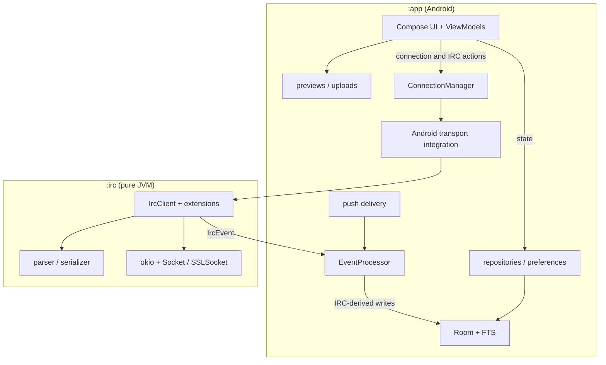

# Architecture

MOTD has two Gradle modules: `:app` is the Android application and `:irc` is a
pure-JVM IRC engine with no Android dependencies.

## Key invariants

- `EventProcessor` is the only component that writes IRC-derived state to Room.
  Feature-local persistence, such as preferences and upload history, remains
  behind its own repository or preference contract.
- UI observes repositories and ViewModel state. Connection and protocol actions
  go through `ConnectionManager` instead of constructing IRC clients in screens.
- TLS policy, Android KeyChain integration, proxy selection, and embedded
  obfuscation are injected at the `:app` boundary so `:irc` stays pure JVM.
- IRC TCP/TLS uses okio over `Socket`/`SSLSocket`. App-side WebSocket transport
  uses the pinned OkHttp dependency. HTTP previews and attachment uploads use
  their existing `HttpURLConnection`-based streaming implementations.
- FOSS is the supported product and release flavor. The dormant Google flavor
  contains unfinished Firebase Cloud Messaging integration and is intentionally
  excluded from CI APK builds and releases. The E2E build is x86_64-compatible
  and intentionally omits the arm64-only libbox JNI.

## XMPP subsystem

XMPP is a parallel vertical slice next to IRC, not a shared abstraction: the
IRC pipeline is untouched, and a second stack — `XmppConnectionManager` with
one account actor per network — talks to the server through Smack behind the
`XmppSession` seam (`SmackXmppSession` is the concrete adapter; fakes back the
actor/processor tests). `XmppEventProcessor` mirrors `EventProcessor`'s
invariant: it is the sole writer of XMPP-derived Room state, consuming one
account's stanza events off a single channel/coroutine so writes stay ordered
per network. `RoutingConnectionManager` preserves the single `ConnectionManager`
UI seam by dispatching each call to the IRC or XMPP manager based on the target
network's `protocol` column, so ViewModels and screens are unchanged.

Both protocols share the existing Room tables, discriminated at the network
level (schema v17: `networks.protocol` and nullable `networks.jid`). XMPP
messages dedupe through a dedicated `XMPP_MSGID` event-alias namespace, kept
separate from IRC's `MSGID` namespace because XMPP client-generated ids are
only unique per sender rather than globally.

The UI stays capability-gated rather than protocol-specific: a per-buffer
`ProtocolCapabilities` value hides reactions, replies, and slash commands
beyond the small XMPP-supported set (`/me`, MUC nick autocomplete) on XMPP
buffers, and 1:1 typing indicators ride XEP-0085 chat states. Incoming XMPP
messages do not yet raise notifications: `MessageNotifier` is IRC-typed, and a
protocol-neutral notification hook is the planned follow-up. XMPP accounts
always use the persistent-socket delivery path — `BootReceiver` and the
push-idle teardown both treat any configured XMPP network as requiring the
socket, since XMPP has no push mode of its own yet. XEP-0198 is enabled for
send acknowledgements only, not stream resumption: every reconnect is a clean
login and MUC rejoin, and any pending row left unacknowledged across that
reconnect flips to `failed`. Unlike IRC there is no retry affordance in v1, so a
failed XMPP send must be re-typed.

## Where to work

- `app/src/main/.../ui/` — Compose screens, components, navigation, and
  ViewModels.
- `app/src/main/.../data/` — Room, repositories, sync, preferences, and feature
  persistence.
- `app/src/main/.../service/` — connection ownership and Android lifecycle.
- `irc/src/main/` — protocol, client state machine, extensions, and transport.

Repository policy and task workflows live in [`AGENTS.md`](AGENTS.md) and
[`.agents/`](.agents/README.md). Historical design documents under
[`plans/`](plans/README.md) explain original intent but are not current
contracts.
