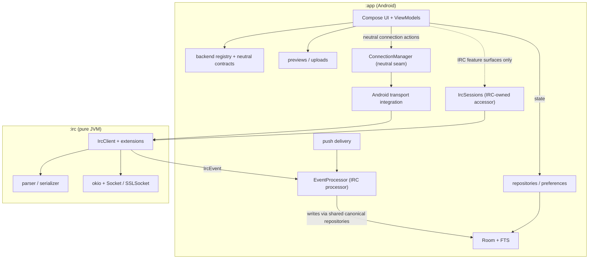

# Architecture

motd has two Gradle modules: `:app` is the Android application and `:irc` is a
pure-JVM IRC engine with no Android dependencies. Inside `:app`, a
backend-neutral seam separates shared MOTD behavior from the IRC adapter
(docs/backend-neutral-xmpp-rollout.md): `backend/` holds the protocol-open
contracts (`ProtocolId`, `BackendRegistry`, `ConnectionState`), the network row
carries a persisted `protocol` discriminator, and IRC-only feature surfaces
reach the live session through the IRC-owned `IrcSessions` accessor instead of
a client escape hatch on the shared seam.

## Key invariants

- Each backend has exactly one processor that turns its wire events into
  canonical facts, persisting only through the shared canonical repositories;
  a network belongs to exactly one backend, so chat-derived state keeps a
  single writer per network. `EventProcessor` is that processor for IRC.
  Feature-local persistence, such as preferences and upload history, remains
  behind its own repository or preference contract.
- UI observes repositories and ViewModel state. Connection actions go through
  the backend-neutral `ConnectionManager` seam (neutral `ConnectionState` with
  per-session generations, purpose contracts for identity, history
  availability, push, reactions, and attachment endpoints). IRC feature
  surfaces (DCC, bouncer, avatars, channel moderation/browsing, server admin,
  webpush registration, composer slash commands) use the IRC-owned
  `IrcSessions` accessor; general chat, notification, history, and connection
  code must not. Notification and sound presentation consume canonical
  `MessageEntity` rows, never wire events. `ImportBoundaryTest` enforces the
  wire-type boundary with an audited exemption table.
- TLS policy, Android KeyChain integration, proxy selection, and embedded
  obfuscation are injected at the `:app` boundary so `:irc` stays pure JVM.
- IRC TCP/TLS uses okio over `Socket`/`SSLSocket`. App-side WebSocket transport
  uses the pinned OkHttp dependency. HTTP previews and attachment uploads use
  their existing `HttpURLConnection`-based streaming implementations.
- FOSS is the supported product and release flavor. The dormant Google flavor
  contains unfinished Firebase Cloud Messaging integration and is intentionally
  excluded from CI APK builds and releases. The E2E build is x86_64-compatible
  and intentionally omits the arm64-only libbox JNI.

## Where to work

- `app/src/main/.../ui/` — Compose screens, components, navigation, and
  ViewModels.
- `app/src/main/.../data/` — Room, repositories, sync, preferences, and feature
  persistence.
- `app/src/main/.../service/` — connection ownership and Android lifecycle.
- `irc/src/main/` — protocol, client state machine, extensions, and transport.

Repository policy and task workflows live in [`AGENTS.md`](AGENTS.md) and
[`.agents/`](.agents/README.md). Historical design documents under
[`plans/`](plans/README.md) explain original intent but are not current
contracts.
